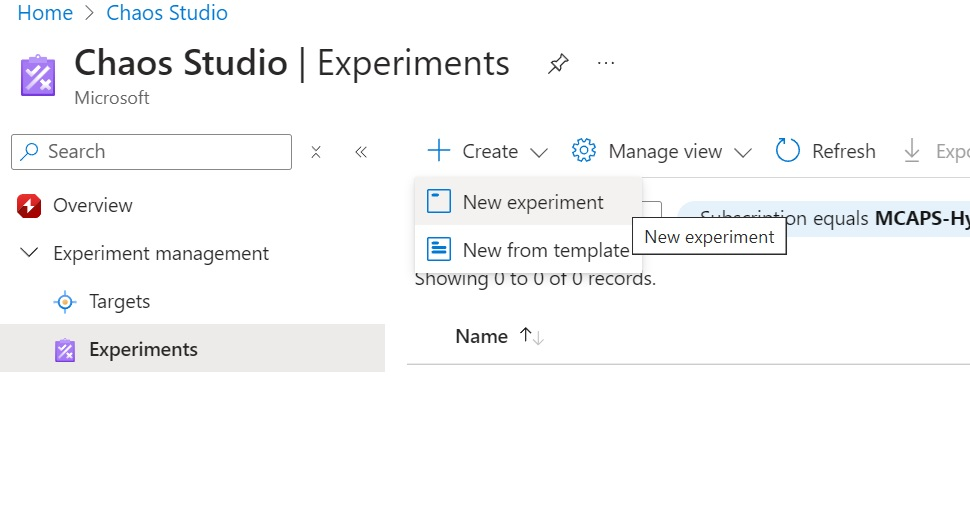
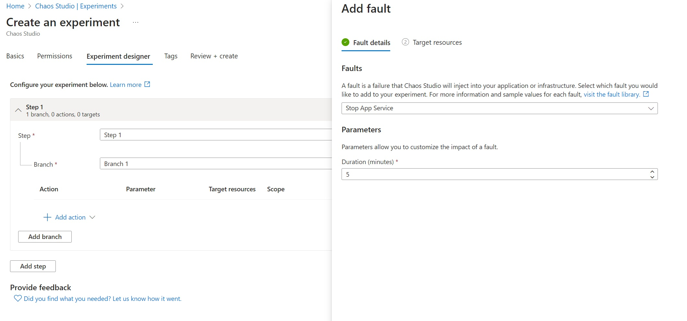
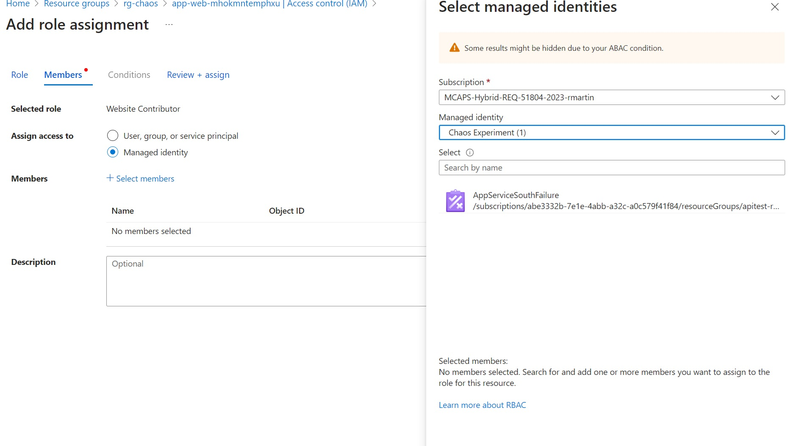
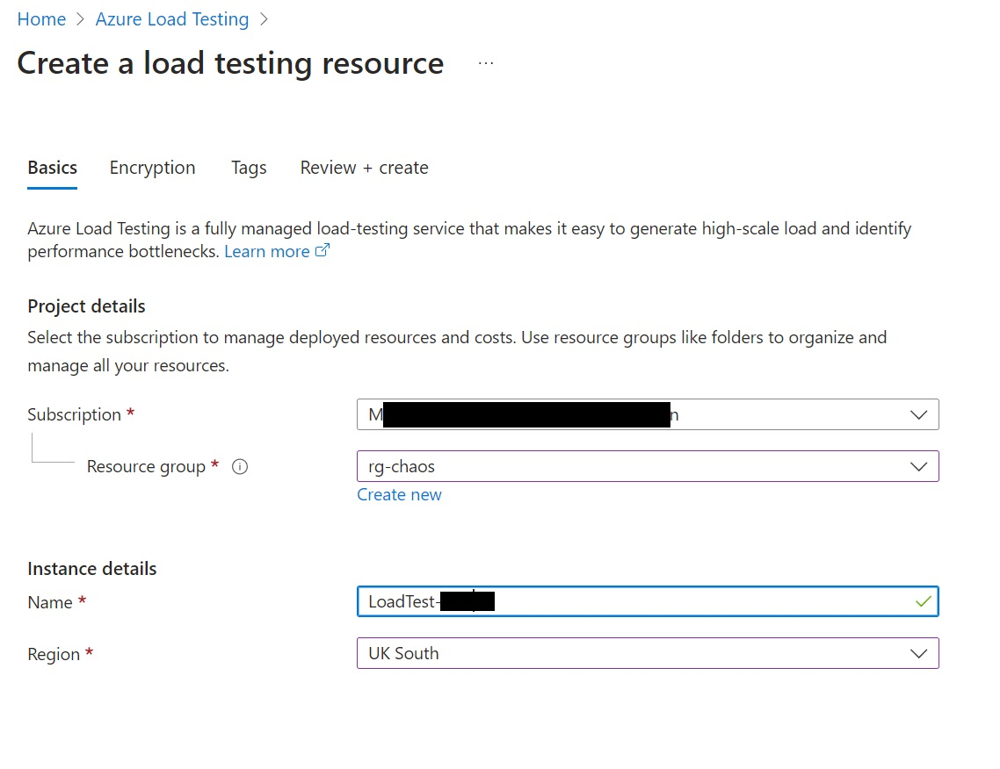
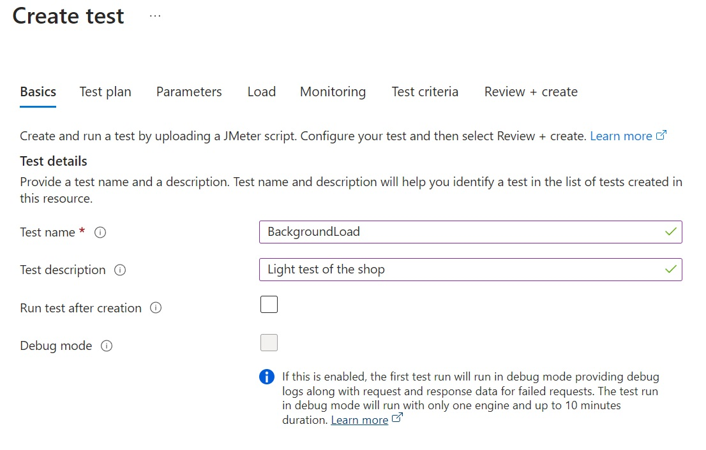
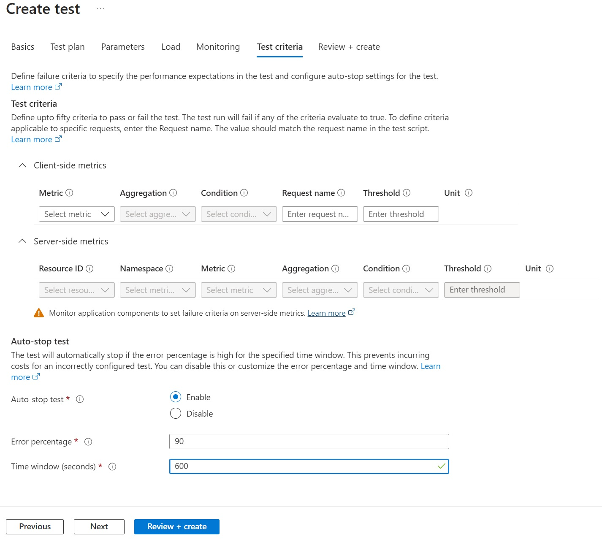
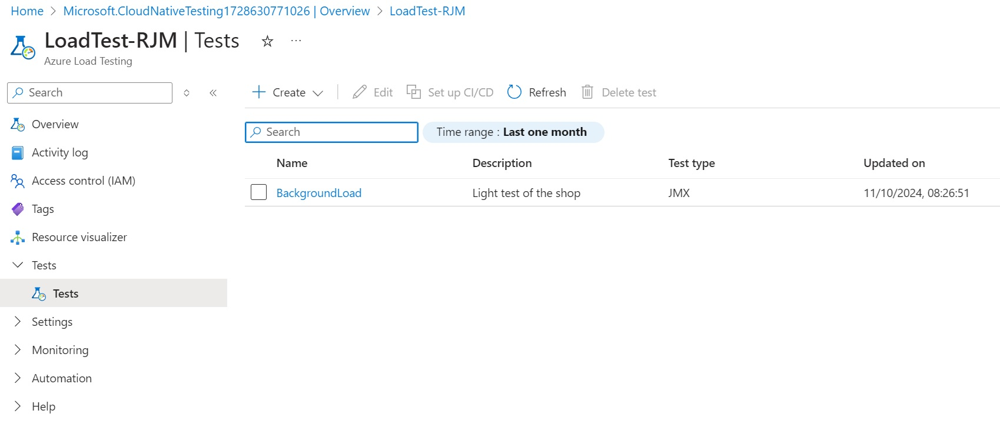
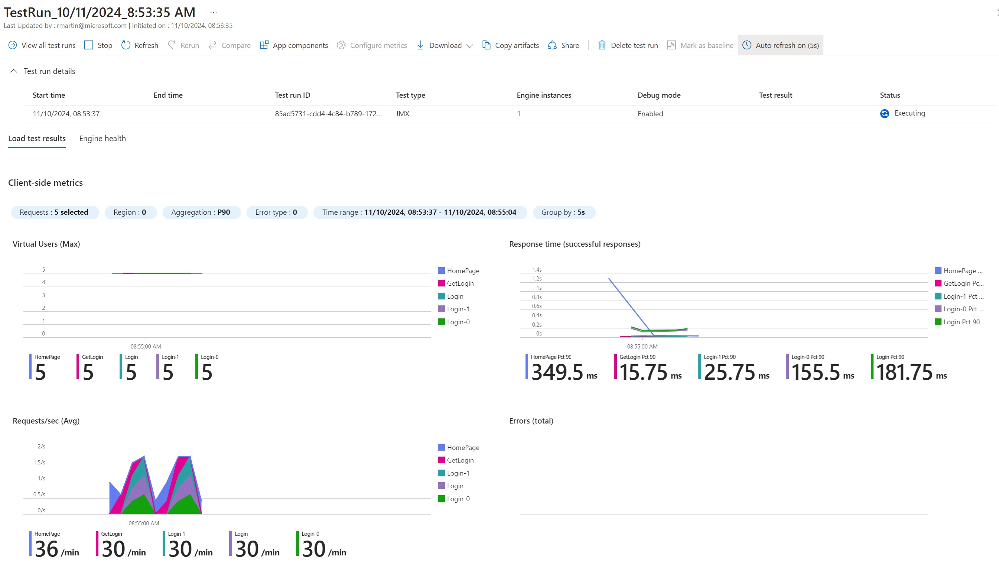
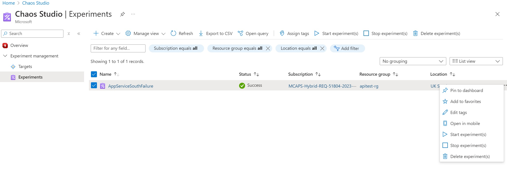
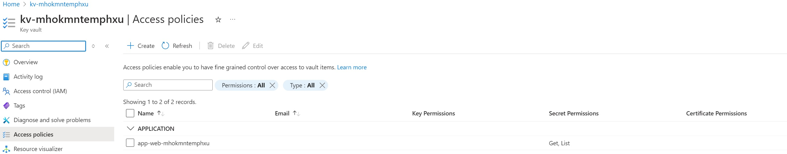

# Chaos Studio Lab Exercise
We're going to deploy a solution to a test environment, then use that environment to run some experiments to see how the system behaves when certain services are disrupted. After the experiment has concluded, we'll see how the system performs once the stressed have been removed.

Following the initial experiment, we'll propose improvements to the solution design and/or implementation. Once these enhacements are made, we can re-test our experiment to validate how the theory holds up.

## Enabling Chaos Studio
We first need to enable Chaos Studio for use in the subscription. To do this we need to register the Chaos Studio Provider. This only needs to be done once, to 

You can do this with the Azure CLI, using the command  `az provider register --namespace Microsoft.Chaos` or you can use the Azure Portal under the **Settings** and **Resource Providers** section. Here you can search for Microsoft.Chaos to Register Chaos Studio

  

## Deploying the Test System
We're going to use a sample application to deploy An Azure App Service, Key Vault and SQL Databases to our test subscription. We're going to use the Azure Developer CLI for this. 

1. Start, by opening a new Terminal Windows. If you don't have the Azure Developer CLI Installed already, then you can download using on Windows 10 or 11 using `winget install azd'. Or alternatively, follow the steps on this page to install [Azure Developer CLI Install](https://learn.microsoft.com/en-us/azure/developer/azure-developer-cli/install-azd?tabs=winget-windows%2Cbrew-mac%2Cscript-linux&pivots=os-windows)

2. Change to a suitable folder in the terminal for the source code and create a new folder using `mkdir eShopOnWeb` then change to this folder `cd eShopOnWeb`

3. You'll need some pre-requisites for your development workstation as the solution using Microsoft .NET 8. you can check that this is installed using `dotnet --list-sdks'.
    If dotnet 8 isn't installed, you canm use `winget install microsoft.dotnet.sdk.8' to install the dotnet 8 SDKs

4. We'll now pull down the template project using Azure Developer CLI. First we need to login to the developer CLI. To to this we'll use `azd auth login' then, sign-in with our usual credentials which has access to an Azure Subscription we'll deploy to in a momeent

5. We'll now download the template using `azd init -t dotnet-architecture/eShopOnWeb`

6. Finally, we'll build and package up the solution to our subscription using the single command `azd up` where we'll be prompted to provide an **environment** name, choose an **Azure Subscription** to deploy to and a **location** for the deployment.
    * For the **enviroment** use `chaos` and choose `UK South` for the **location** to deploy to.


> For more information on the eShopOnWeb sample project see https://github.com/dotnet-architecture/eShopOnWeb

## Verify the site is working

 Once the  web site has finished deploying. We'll create a few orders to make sure the site is working.
 
 1. Open the web-site in your browser
 2. Add a few items to the basket.
 3. Checkou the basket and proceed to payment
 4. At this point, you'll need to login. For this demo site, there is no need to register, and you can log in using the account `demouser@microsoft.com` and `Pass@word1`
 5. The order will be placed and recorded in the database.
 6. Check the order history and confirm that the order appears in the list.

## Scale up the resources

The script setups up the web-site as a B1 plan for development. In readiness for some testing, We're going to upgrade the service plan to a Premium v3 P0V3 plan.


## Onboarding Resources for Chaos

While we often talk about simulating a failure or injecting a fault, it's important to realise that a Chaos Studio experiments **will** cause disruption to services. Security is vitally important, and as an additional safety mechanism, resources need to be onboarded for Chaos Studio and enabled for chaos. This is to reduce the chance of accidentally injecting Chaos in a live environment.

In the Azure Portal, Type Chaos Studio into the Search Bar. Then expand the `Experiments management` section on the left-hand nav pane


To make it easier to find the resources for our experiment, we'll filter by resource group `rg-chaos` and the subscription.


You should see **two** resources, one for Key Vault and one for the Azure App Service. Check both resources and choose **Enable Targets** 
In the drop-down select Service-Direct targets (all services)


Select Review and Enable and confirm. This step enables the resources with the resoruce provider.

## Create an experiment

We'll going to create an experiement to disable the app-service simulaing a regional App Service Failure. 

1. In the Chaos Studio, choose Experiments
2. Select `Create` to create a new experiment
3. We can choose to use a template or we can create our own. For this lab, we're going to create a new experiment



4. We now need to choose a name for our experiment, let's name this `AppServiceSouthFailure`

5. Move to permissions. Here we'll select `System Assigned Identity` - What this does is create a managed identity for the experiment which we'll use later to lock down the right permissions

6. In the Experiment, we can now create the Steps and Branches 

7. We'll create a Fault Action which will shut down the App Service for 5 minutes



8. We can select the App Service from the enabled list of App Services we want to stop, or we could create a dynamic list of services using a KQL query. For this experiment, we'll simply choose the App Service manually

9. Select Review and Create to Create the experiment


## Set permissions for the Experiment

The System Managed Identity is named after the chaos experiment. As an aditional safety mechanism, we need to grant permissions to the Experiment to the resources.

 In this case, we need to gran the experiment **Web Contributor** role so it can stop/start the App Service




## Generate some load for the serivce.

We'll need some load to test the service is working. A starter Azure Load Test is available in the repo, which you can use to generate some background load on the site. The load-test creates a light background load, by logging and lookign for past orders. You can get the load test from the `jmeter` folder in this repo.


1. Change the `hostname` variable to match the site you have deployed. Edit your copy of TestPlan.jmx to include your appservice hostname

``` xml
    <Arguments guiclass="ArgumentsPanel" testclass="Arguments" testname="config">
        <collectionProp name="Arguments.arguments">
          <elementProp name="hostname" elementType="Argument">
            <stringProp name="Argument.name">hostname</stringProp>
            <stringProp name="Argument.value">app-web-YOURHOSTNAMEHERE.azurewebsites.net</stringProp>
            <stringProp name="Argument.metadata">=</stringProp>
          </elementProp>
        </collectionProp>
    </Arguments>        
```

2. Create a Load Testing Resource in the Azure Portal. Create this in the `rg-chaos` resource group. 



3. Proceed through the wizard and Create the resource. This may take a few minutes to complete. Once it's ready go to the resource.

4. We'll now create a Load Test based on our script. Select the Upload a Script option
5. Choose a **name** for our test, and enter a breif **description** of the test.  You need to give this a unique name, for this lab you can simply add your name or alias to the suffix. 
6. Untick the `run test after creation` box




7. Move to the **Test Plan** section and browse to  your edited `TestPlan.jmx` file with the hostname in. Remember to click the **Upload** button

8. Move on to the **Test Criteria** section. We'll  extend the time the test can return failures to 10 minutes.



9. We can now, Review and Create the test. Once the test is created, we should be able to see it created and listed under our Tests



10. We can start the load test running now, note the response times and the service is working. After a short while, test result will start flowing in from the Load Test and we can see the response times and health of the service



## Start the experiment running

Now the load test is running, we're ready to start our experiment. Back to the Azure Portal, we can now trigger off our chaos experiment. Remember this experiment, is intended to shutdown the app service for 5 minutes simulating a regional app service failure. The expected outcome in this case is that  the site will be unavailable because of the interruption.

1. If you're not already at the Chaos Studio page. Use the Search Box to find your Chaos Studio again.
2. You should see your experiments listed. Select the experiment we previously created



3. Select Start to execute the experiment. Shortly after the experiment is starting, you'll see the status change to PreProcessing 
4. When the experiment moves to Running we should start to see failures in the load test - you can also see the page faulting when opening from the browser
5. After 5 minutes the chaos is lifted and the App Service is starts again - we should start seeing 200 OK responsed from the load test signalling the service is restored.


## Making the service more robust

A second App Service, in another region for example could make this solution more robust. In a live environment, the App Services would typically be on a private VNET and fronted by a load balancer. In this scenario, we'll deploy a second App Service and manually configure the load balancer with a new public IP address.

Normally we would do this through a pileline. Here we'll build the web-site and package it into a zip file. First `cd` to the `src\web` folder of the eShopOnWeb project. Change the `D:\out`  path to a stuiable empty folder on your system

We'll first create a new Resource Group in `UK West` for the second App Service. We'll call this `rg-chaos2`

We'll copy some of the settings from the original site and create a new webapp with 2 added to the end to represent a second region.

`az group create -g rg-chaos2 --location ukwest`

`az webapp create --runtime "dotnetcore:8.0" --plan mywestplan  --name app-web-mhokmntemphxu2 --sku 'B1' -g 'rg-chaos2' --location ukwest`

```
az webapp config appsettings set --resource-group rg-chaos2 --name app-web-mhokmntemphxu2 --settings AZURE_KEY_VAULT_ENDPOINT=https://kv-mhokmntemphxu.vault.azure.net AZURE_SQL_CATALOG_CONNECTION_STRING_KEY=AZURE_SQL_CATALOG_CONNECTION_STRING AZURE_SQL_IDENTITY_CONNECTION_STRING_KEY=AZURE-SQL-IDENTITY-CONNECTION-STRING
```

We'll also need to grant **Secret List** and **Get** Access on the original Key Vault



```
cd src\web
dotnet publish -c Release .\src\web\web.csproj -o d:\out
```

Now change to the out folder you previously created and create a ZIP from PowerShell using

```
cd D:\out
compress-Archive -Path * -DestinationPath D:\WebSite.zip
```

We can then finish by deploy the ZIP to the second site

`az webapp deploy -g 'rg-chaos2' --src-path D:\WebSite.zip --name app-web-mhokmntemphxu2`


## Add a load balancer and 

Add an Azure Load Balancer or Application Gateway with a public IP to balance traffic between the two App Regions.

Update the hostname of the Load Test to use the address of the load balancer and repeat the Load Test. Confirm that the site is still working from the load balancer.

Run the Chaos Experiment again. What happens?


