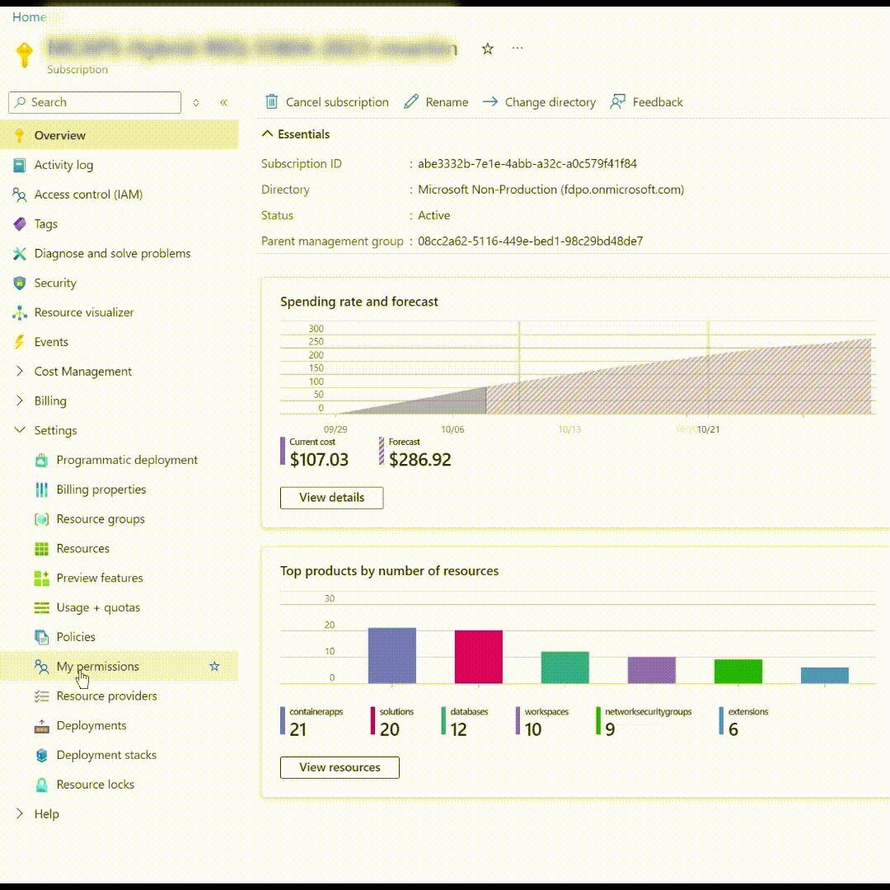
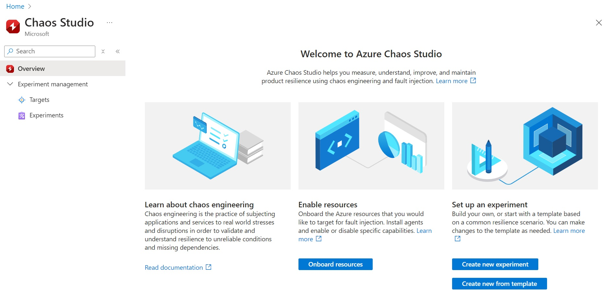
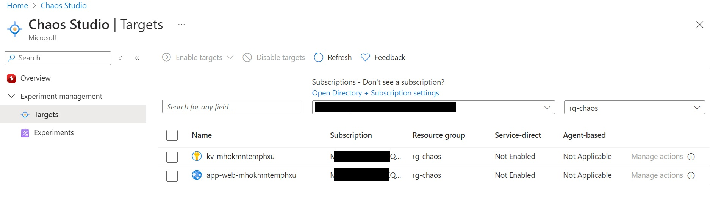
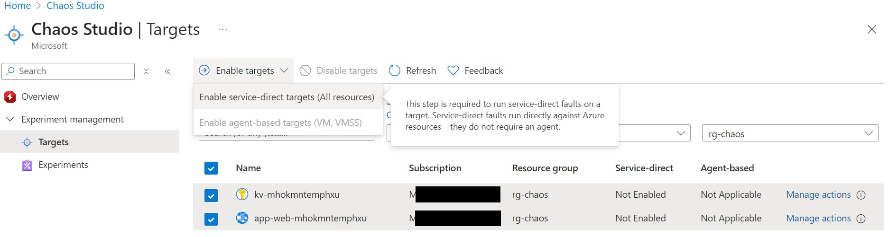

# Chaos Studio Lab Exercise
We're going to deploy a solution to a test environment, then use that environment to run some experiments to see how the system behaves when certain services are disrupted. After the experiment has concluded, we'll see how the system performs once the stressed have been removed.

Following the initial experiment, we'll propose improvements to the solution design and/or implementation. Once these enhacements are made, we can re-test our experiment to validate how the theory holds up.

## Enabling Chaos Studio
We first need to enable Chaos Studio for use in the subscription. To do this we need to register the Chaos Studio Provider. This only needs to be done once, to 

You can do this with the Azure CLI, using the command  `az provider register --namespace Microsoft.Chaos` or you can use the Azure Portal under the **Settings** and **Resource Providers** section. Here you can search for Microsoft.Chaos to Register Chaos Studio

  

## Deploying the Test System
We're going to use a sample application to deploy An Azure App Service, Key Vault and SQL Databases to our test subscription. We're going to use the Azure Developer CLI for this. 

1. Start, by opening a new Terminal Windows. If you don't have the Azure Developer CLI Installed already, then you can download using on Windows 10 or 11 using `winget install azd'. Or alternatively, follow the steps on this page to install [Azure Developer CLI Install](https://learn.microsoft.com/en-us/azure/developer/azure-developer-cli/install-azd?tabs=winget-windows%2Cbrew-mac%2Cscript-linux&pivots=os-windows)

2. Change to a suitable folder in the terminal for the source code and create a new folder using `mkdir eShopOnWeb` then change to this folder `cd eShopOnWeb`

3. You'll need some pre-requisites for your development workstation as the solution using Microsoft .NET 8. you can check that this is installed using `dotnet --list-sdks'.
    If dotnet 8 isn't installed, you canm use `winget install microsoft.dotnet.sdk.8' to install the dotnet 8 SDKs

4. We'll now pull down the template project using Azure Developer CLI. First we need to login to the developer CLI. To to this we'll use `azd auth login' then, sign-in with our usual credentials which has access to an Azure Subscription we'll deploy to in a momeent

5. We'll now download the template using `azd init -t dotnet-architecture/eShopOnWeb`

6. Finally, we'll build and package up the solution to our subscription using the single command `azd up` where we'll be prompted to provide an **environment** name, choose an **Azure Subscription** to deploy to and a **location** for the deployment.
    * For the **enviroment** use `chaos` and choose `UK South` for the **location** to deploy to.

> For more information on the eShopOnWeb sample project see https://github.com/dotnet-architecture/eShopOnWeb

## Verify the site is working

 Once the  web site has finished deploying. We'll create a few orders to make sure the site is working.
 
 1. Open the web-site in your browser
 2. Add a few items to the basket.
 3. Checkou the basket and proceed to payment
 4. At this point, you'll need to login. For this demo site, there is no need to register, and you can log in using the account `demouser@microsoft.com` and `Pass@word1`
 5. The order will be placed and recorded in the database.
 6. Check the order history and confirm that the order appears in the list.

## Scale up the resources

The script setups up the web-site as a B1 plan for development. In readiness for some testing, We're going to upgrade the service plan to a Premium v3 P0V3 plan.

## Onboarding Resources for Chaos

While we often talk about simulating a failure or injecting a fault, it's important to realise that a Chaos Studio experiments **will** cause disruption to services. Security is vitally important, and as an additional safety mechanism, resources need to be onboarded for Chaos Studio and enabled for chaos. This is to reduce the chance of accidentally injecting Chaos in a live environment.

In the Azure Portal, Type Chaos Studio into the Search Bar. Then expand the `Experiments management` section on the left-hand nav pane

To make it easier to find the resources for our experiment, we'll filter by resource group `rg-chaos` and the subscription.

You should see **two** resources, one for Key Vault and one for the Azure App Service. Check both resources and choose **Enable Targets** 
In the drop-down select Service-Direct targets (all services)

Select Review and Enable and confirm. This step enables the resources with the resoruce provider.

## Create an experiment

